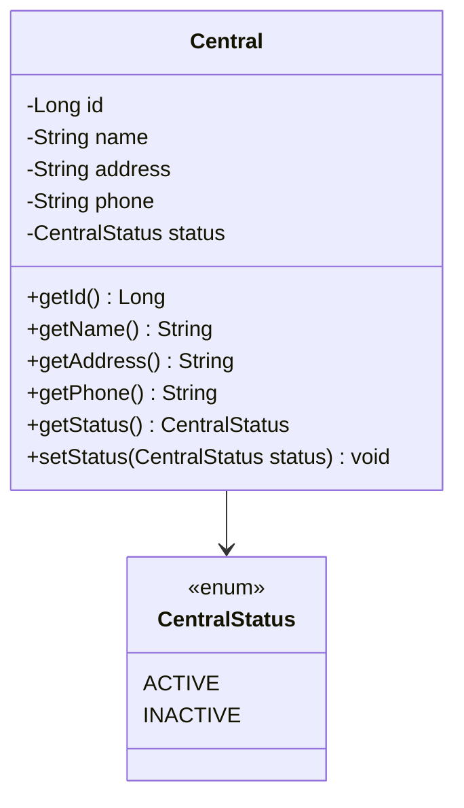

# Diagrama de Clases: Módulo Central

```mermaid
classDiagram
    class CentralStatus {
        <<enum>>
        ACTIVE
        INACTIVE
    }

    class Central {
        -Long id
        -String name
        -String address
        -String phone
        -CentralStatus status
        +getId() Long
        +getName() String
        +getAddress() String
        +getPhone() String
        +getStatus() CentralStatus
        +setStatus(CentralStatus status) void
    }

    Central --> CentralStatus
```